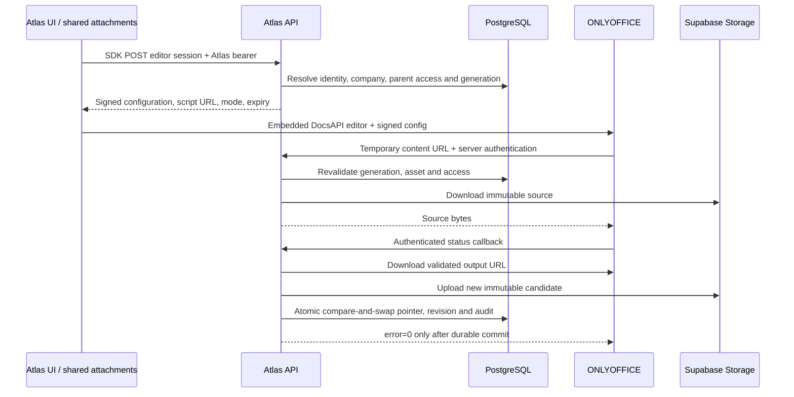

# Embedded Office editing in Atlas Files

Date: 2026-09-07
Status: Proposed — discussion only; implementation requires a subsequent user instruction
Plan: ../plans/2026-09-07-office-editor-plan.md

## Context and repository evidence

This document describes proposed work, not an implemented feature. No runtime,
database, deployment or installer changes have been made for Office yet.

The user's latest instruction supersedes the attachment's automatic execution:
prepare and discuss a proposal before implementation. Licensing is an unresolved
distribution decision, not an obstacle to preparing this proposal. The root
package is private and no tracked LICENSE file was found; neither fact alone
establishes a proprietary license. Do not silently relicense Atlas or substitute
another editor.

## Proposal revision: recommended product decisions

The detailed sections below are a design baseline, not evidence that protocol,
deployment or permission behavior has been proven. Before final schema design,
validate the integration against the selected real provider artifact.

| Decision | Recommendation | Reason |
| --- | --- | --- |
| Product placement | Optional capability of core Files, shared with attachments | One file identity, one storage owner, existing navigation. |
| Provider | ONLYOFFICE Docs API adapter | Matches Atlas's storage/callback ownership; keep provider code in a small boundary without building a plugin framework for hypothetical providers. |
| First release | DOCX/XLSX/PPTX, standalone Files plus at least one verified attachment integration | Establish end-to-end behavior without claiming every module's ACL has been audited. |
| Opening behavior | Explicit Edit; preserve existing Open/preview behavior initially | Avoid starting an editing session when someone only wants to inspect a file. Office view can be offered explicitly where useful. |
| Screen | Dedicated Files editor route; same editor in a full-size attachment host | Space for spreadsheets without discarding the source module context. |
| Saving | Native collaboration autosave plus durable Atlas checkpoints and final save | Editor state and Atlas persistence are different promises. |
| History | Recovery foundation now; user-facing history/restore later | Previous bytes must be retained from the first editable release. |
| Upload size | Retain 10 MiB initially | Validate output growth and failure recovery before changing a platform-wide limit. |
| Operations | Disabled by default; optional office Compose profile | Ordinary Files survives a missing or failed Docs service. |
| Distribution | Settle edition/license before packaging for the chosen commercial model | API separation alone is not a legal conclusion. |

The first attachment integration must be chosen after tracing its authoritative
relationship and read/write rules. Reusing AttachmentsPanel proves UI reuse, not
authorization across HR, projects, chat and every custom module. Do not translate
general file-update permission into permission to modify a finalized document,
an inaccessible project or a private conversation's attachment.

### Corrections and unresolved engineering points

1. **Save ordering needs proof.** A mutex or compare-and-swap prevents simultaneous
   writes but does not prove that the last-arriving callback has the newest content.
   A content hash identifies equal bytes, not chronological order. Validate a
   correlated, serialized checkpoint protocol using the official forcesave command
   and its `userdata` field, allowing one outstanding request per generation.
   Treat retries, timeouts and uncorrelated callbacks explicitly; retain ambiguous
   candidates without promoting them over a known newer revision. A final save
   retires the generation so late checkpoints cannot overwrite it. Do not claim
   this protocol is solved before testing it against the actual server.
2. **Session expiry is not permission revocation.** Expiring a config JWT does not
   automatically disconnect an editor that already downloaded the document. Plan
   provider-side participant disconnection, server-side rechecks and a final-save
   grace period. On revoked access, preserve output for authorized recovery without
   silently accepting it into the live file or allowing a deleted file to reappear.
3. **Visible save state needs an acknowledgment path.** Report the last successful
   Atlas checkpoint time; a clean editor event or accepted force-save command is
   not a database/storage acknowledgment. Prefer the existing authorized realtime
   infrastructure if appropriate, with explicit status refresh on reconnect/close.
   A save can continue while another collaborator remains in the document.
4. **Recovery has limits.** Immutable candidates protect against failed replacement,
   not loss of uncheckpointed work after destruction of the Docs runtime. Persist
   the provider's required recovery state and test restarts. Define a checkpoint
   interval and measured recovery objective during the pilot; do not promise zero
   lost keystrokes or invent a supported interval without testing.
5. **Refactors should stay bounded.** Correct the batch URL tenant scope and extract
   the touched Files routes. Do not require rewriting the whole API entry point or
   changing every module's attachment policy before a standalone Files prototype.
   Parent ACL enforcement is mandatory for each attachment integration enabled.
6. **Schema detail is provisional.** Persist revisions, shared generations,
   participant grants and save receipts. Decide separate tables versus constrained
   records after the protocol experiment, rather than treating the number of new
   tables in this baseline as a product requirement.

Official protocol references: [saving FAQ](https://api.onlyoffice.com/docs/docs-api/more-information/faq/saving/)
and [forcesave command](https://api.onlyoffice.com/docs/docs-api/additional-api/command-service/forcesave/).
The command supports correlating requests; the proposed scheduling and durability
rules are Atlas design choices, not guarantees supplied by that documentation.

### Proposed delivery gates

| Gate | Deliverable | Evidence required |
| --- | --- | --- |
| Proposal | Agree on scope, UX, hosting and intended distribution | This document reviewed with the owner; no runtime change. |
| Technical experiment | Real Docs + Atlas session/download/callback flow with disposable documents | XLSX edit/reopen, two editors, view-only, force-save/final-save sequencing, server restart and exact image/config verification. |
| Safe Files release | Permissions, format checks, durable revisions, editor host and recovery | Real database race/failure tests, tenant-denial requests, storage failure and callback replay tests. |
| Attachment release | Shared host plus a verified module integration | Read/write/parent lifecycle tests through the attachment UI and direct API requests. |
| Installer release | Local/external setup, HTTPS/proxy coexistence and service-off fallback | Fresh installs and upgrade reruns, strong stable secrets, browser and container reachability. |

Primary effort drivers are save consistency, parent authorization and deployment
testing. Loading the iframe is a small part of the feature. Estimate implementation
effort after the technical experiment; do not present an unsupported fixed schedule
or assume the external editor has negligible memory/storage/maintenance cost.

Reviewed entry points and findings:

| Area | Current implementation | Consequence |
| --- | --- | --- |
| Architecture | `CLAUDE.md`, `AGENTS.md`, `README.md`, `docs/01_erp_architecture.md`, `docs/03_core_modules.md`, AME3 reference and runtime inventory | This extends core `atlas.files`; it is not a second AME3 file manager. |
| Upload and metadata | `apps/api/src/services/files-service.js` | 10 MiB limit. Standard uploads put company ID in `entityId`, actual parent in `metadata.sourceEntityId`; metadata is partly caller-supplied. |
| Storage | Same service | Private `atlas-files`; public uploads may use `atlas-website`. Office MVP accepts private assets only. |
| Formats | Same service | DOCX/XLSX allowed, PPTX missing. MIME supplied by client is currently trusted. |
| Routes | `/files` handlers in `apps/api/src/index.js` | Auth + granular RBAC; not a `routes/files.js` file. Extract files routes before adding more to the oversized entry point. |
| Access | `getUserCompanyContext`, `ensureFileBelongsToCompany` | Latest enabled membership selects company; current asset access does not itself prove parent entity access. |
| Batch URLs | `POST /files/batch-signed-urls` in API entry point | Query filters IDs and enabled state, without company scope. Must close this exposure as part of file authorization work. |
| SDK | `packages/sdk/src/index.js`, `files` group | upload/list/get/getSignedUrl/batchSignedUrls/rename/bulkDownload/setEnabled/delete; preserve token arguments and response envelopes. |
| Explorer | `apps/desktop/src/modules/atlas.files/screens/FilesScreen.jsx` | Existing list, grid, cards, detail route and permission checks. |
| Viewer | `components/AdvancedFileViewer.jsx`, `PDFViewer.jsx` under atlas.files | Existing fullscreen media experience, touch gestures, filmstrip, context menu; preserve PDF/image behavior. |
| Shared attachments | `packages/ui/src/components/AttachmentsPanel.jsx`, `hooks/useAttachmentsController.js` | Shared inline attachment flow; Office belongs in shared UI, with API/SDK-mediated sessions. |
| File schema | `prisma/schema.prisma`: FileAsset | One object pointer, optional checksum and metadata; no dedicated content revisions or editor sessions. |
| Audit | Same schema: AuditLog | Actor and entity references, before/after/metadata; no document bytes or credentials in events. |
| Installer | `infra/installer/setup-local.mjs`, `setup-external.mjs`, `lib/livekit-config.mjs`, bootstrap scripts and tests | Optional service pattern already generates secrets and selects Compose profiles; bootstrap download lists must include new helpers. |
| Docker | `infra/installer/docker-compose.yml`, Linux override | Both API profiles expose shared `api` network alias. Local Supabase is managed separately by setup. |
| Proxy | `infra/installer/nginx/spa.conf` | Catch-all rewrites to public website; it is not a generic API proxy. Office callback URLs must not point there accidentally. |
| Native | `apps/desktop/src-tauri/tauri.conf.json` | CSP currently null; browser success is not proof of WebView success. |

Recent history inspected includes `a07d205a` (viewer context menu), `341d1ca0`
(touch/filmstrip), `106fd443` (public SPA routing), `5b42980b` (installer environment
generation), and `ec21fe21` (LiveKit setup). Existing uncommitted chat work is outside
this feature and must be preserved.

## License, distribution and edition selection

Official sources reviewed on the date above:

- [Community licensing FAQ](https://helpcenter.onlyoffice.com/docs/faq/docs-community.aspx): AGPLv3 obligations for modifications/derivative works, retention of branding, commercial licensing for proprietary integrations; Community has no mobile web edition, clustering or SLA.
- [License FAQ](https://www.onlyoffice.com/license-faq): internal commercial use is distinguished from incorporating ONLYOFFICE source into another application.
- [9.4 release announcement](https://www.onlyoffice.com/blog/2026/05/onlyoffice-docs-9-4): Community removed the 20 simultaneous connection limit in 9.4; AGPLv3 includes additional attribution/distribution terms and a separate trademark policy.
- [Upstream releases](https://github.com/ONLYOFFICE/DocumentServer/releases): the page reviewed identifies 9.4.0 as latest. Candidate baseline is 9.4.0; verify actual Community Docker tag, platform manifest and immutable digest before committing a deployment pin. A release tag is not evidence of an available container tag.
- [Collabora licensing](https://www.collaboraonline.com/terms/collabora-online-mplv2/) and [CODE](https://www.collaboraonline.com/code/): alternative uses primarily MPLv2; CODE is the development edition, so a production/support assessment is still necessary.

Commercial activity alone does not prohibit AGPL software. Nor does a separate
container automatically resolve derivative-work obligations. These are technical
findings and the vendor's stated position, not a legal determination that an API
boundary necessarily requires relicensing all Atlas code. Select internal use,
compatible open distribution, or an appropriate commercial ONLYOFFICE agreement
before finalizing bundled distribution. Preserve upstream branding. Do not claim
mobile editing parity with Community or promise unlimited practical capacity.

Preferred provider remains ONLYOFFICE. If Atlas must remain closed source and no
suitable commercial license is available, evaluate Collabora with a WOPI adapter;
do not change platforms without the owner's decision.

## Goals and scope

Edit DOCX, XLSX and PPTX from the existing explorer and shared attachments. Atlas
retains file identity, relations, ownership, authorization, storage and lifecycle.
Authorized users share a collaborative editing generation. Read-only users view.
An installation without Office must retain all existing file functions.

MVP does not implement a visible version browser, PDF editing or silent conversion
of legacy formats. DOC/XLS/PPT and ODT/ODS/ODP can gain view support after fixtures
verify their handling. Their editing requires an explicit conversion contract:
never save OOXML bytes under an unchanged legacy extension/MIME.
[Format documentation](https://helpcenter.onlyoffice.com/docs/userguides/document_editor/supportedformats.aspx)
explains conversion to OOXML during editing. Existing PDF preview stays primary.

## Architecture

Use Docs API with signed configuration and official save callbacks. Atlas already
owns a storage service and needs neither WOPI discovery nor its lock/proof-key
protocol for this provider. This is a design choice based on the existing code
and the [official API comparison](https://api.onlyoffice.com/docs/docs-api/using-wopi/api-vs-wopi/).

## API and SDK contract

| Endpoint | Authorization | Response / purpose |
| --- | --- | --- |
| `GET /files/office/status` | Atlas auth + files read | `{data:{enabled,available,formats}}`; cached health, no secret or internal topology |
| `POST /files/:id/editor/session` | Atlas auth + files read + parent read | `{data:{sessionId,mode,expiresAt,scriptUrl,config}}`; update + parent write required for edit |
| `GET /files/:id/editor/sessions/:sessionId` | Same access checks | Durable save/error/expiry state; useful after close/reopen, no aggressive polling |
| `GET /files/office/content/:sessionId` | Scoped expiring content capability + verified ONLYOFFICE request | Binary stream, no-store, source generation bound |
| `POST /files/office/callback/:sessionId` | ONLYOFFICE JWT + server-issued scoped callback capability | Official `{error:0}` or nonzero failure; no Supabase login expected |

Session request allows an optional requested view mode; clients cannot grant edit,
choose another user, company, callback URL, document key or storage object. SDK adds
`files.officeStatus`, `files.createEditorSession`, `files.getEditorSession` with
existing bearer and response conventions. Register static routes before `/files/:id`.

Use 401 for absent/invalid Atlas authentication, 403 for missing capability, 404
for absent/cross-company/inaccessible assets, 409 for conflicting generation, 415
for unsupported content, and 503 for disabled/unavailable editor. Callback error
responses follow the provider protocol rather than the normal SDK envelope.

## Authorization and parent entities

Reuse `files.assets.read` and `files.assets.update`; add no redundant Office role.
Resolve UserProfile from the verified auth identity and enabled membership in the
same company used by existing Files behavior. Revalidate during content delivery
and saves; a token alone does not override revocation, disablement or deletion.

Introduce a central asset access resolver. Company scoping is necessary but not
sufficient for attachments. Parent adapters call the owning service's permission
and membership rules and verify a real attachment relationship. Caller-authored
metadata is a hint, not proof. Unknown parent types fail closed for Office until
an adapter exists. Plain AtlasFile assets use company + files permissions. Generated
documents and immutable parent workflows can force read-only. A client `readOnly`
prop restricts UX only; the API remains authoritative.

Apply the resolver to batch signed URLs as well. Test direct endpoint access, not
only the UI. Preserve any intentional public-file contract separately.

## Persistence, concurrency and recovery

Add core persistence with a new forward Prisma migration (not AME3 business tables):

- File content revision counter/current revision linkage.
- `FileAssetRevision`: asset, generation, immutable object pointer, checksum, size,
  creator, creation time and retention/recovery status.
- `FileEditorSession`: shared generation, asset/company, expected current revision,
  original object pointer, active/closing/closed/failed state, expiry and save state.
- Participant records bind authenticated Atlas profiles and effective mode to a
  generation; callback attribution must match authorized participants.
- Save receipt uniqueness for idempotency, tied to generation/status/output digest.

UUID entity defaults must follow the project's database UUIDv7 convention. Enable
RLS on new public-schema tables and expose no direct anon/authenticated policies.
Do not reuse arbitrary FileAsset metadata for trusted session state.

Use a database uniqueness constraint/transaction to select one active generation
per asset. The document key is shared across users of that generation and changes
after final commit; never derive it from user ID or regenerate on every open.
Short-lived browser config tokens and longer bounded save leases are separate.
Expiry must allow an orderly final save before generation retirement. Retain an
expired generation's recovery objects; never reopen its key for new edits.

Writes are immutable: upload candidate bytes first, then atomically advance
FileAsset's pointer with an expected-revision condition and create the revision,
receipt and audit record. Retain the old object. A failed transaction leaves a
recoverable candidate, not a damaged original. A failed upload changes no metadata.
Out-of-order callbacks must not overwrite a newer checkpoint. Serialize save work
per generation in durable storage; do not rely on a process-local mutex. Fetching
or uploading bytes must not hold an unbounded database transaction open.

Document replacement, disable/delete and module cleanup must respect active saves
and revisions. Define retention before adding object garbage collection; no eager
deletion of previous revisions. Restoration initially remains an authorized
administrative operation; a visible version timeline is a later phase.

## Callback state machine

Based on the [official callback protocol](https://api.onlyoffice.com/docs/docs-api/usage-api/callback-handler/):

| Status | Atlas action |
| --- | --- |
| 1 | Update collaboration presence; do not create content revisions. |
| 2 | Final save; persist output, close generation after commit. |
| 3 | Record final-save failure and preserve recoverable state. |
| 4 | Close unchanged generation safely, accounting for reconnection behavior. |
| 6 | Force-save checkpoint while editing; retain generation key. |
| 7 | Record force-save failure; do not announce successful persistence. |

Status 2 follows closure, not every keystroke. Enable supported force-save behavior
for explicit Save; status 6 is a recovery checkpoint, not necessarily a visible
version. A final generation commit becomes a user-visible version when the future
history UI exists. Validate signed payload fields; reject mismatches against any
unsigned request data. Callback selection can vary between users/tabs, so every
participant callback must address the same shared generation safely.

Replay of an already committed receipt returns success without a second write.
Stale/conflicting output is retained for recovery and reports failure. File content
must match expected OOXML kind and allowed size before storage pointer replacement.

## Security

Pin the JWT algorithm; verify signatures using a separate strong Office secret,
and validate capability purpose, expiry, generation and asset binding. Support the
documented header/body transport deliberately; see [request signatures](https://api.onlyoffice.com/docs/docs-api/additional-api/signature/request/).
Never accept the browser configuration token as callback authorization.

Output fetches allow only configured server origins and approved output paths.
Reject credentials, fragments, unapproved ports, redirects and alternate schemes;
validate DNS/IP destinations and private-network exceptions against the explicitly
configured Docker service. Block metadata endpoints and DNS rebinding. Use timeouts
and bounded streaming reads; Content-Length alone is insufficient. Do not forward
Atlas bearer tokens to download hosts. Object keys are server generated, never
constructed from an unchecked filename or callback path.

One shared format catalog in `@atlas/core` supplies extensions, canonical MIME,
editor kind, display type and view/edit policy to API/UI. Validate OOXML container
entries, content types and relevant document part with bounded ZIP inspection;
reject ZIP bombs, malformed archives, macros disguised as plain OOXML, and mismatched
extensions/MIME. Retain the 10 MiB limit for the MVP, including edited output; larger
files require measured resource limits and aligned storage/proxy configuration.

No secrets in Vite, URLs logged with query tokens, AuditLog or document content in
logs. Content/session responses are no-store. Production browser URLs require
HTTPS. Keep normal Atlas CORS; callbacks are server-to-server, not a reason for `*`.
Document required script-src/frame-src/connect-src origins where CSP is enabled.

## Frontend and shared components

Create `OfficeDocumentEditor` in `packages/ui/src/components/` and export/document
it. It consumes SDK session results, loads the official script once per origin,
creates/destroys DocEditor safely, and handles script timeout, stale async results,
unmount and expired session. No secrets or privileged direct storage calls.

Files gets a dedicated `/app/m/atlas.files/files/:id/edit` host with PageHeader,
breadcrumbs, available height and a read-only badge. Shared attachments open the
same component in a full-size inline host/Sheet in their existing module, preserving
navigation. Do not force attachment users to visit atlas.files.

Explicit Edit opens edit if authorized. Preserve current Open/preview behavior
initially; automatic opening in edit mode is a later UX decision. PDF/media continue
using current viewers. Missing Office
retains download and current preview with “Edición en línea no disponible”.
Use ErrorState/LoadingState and Sonner for appropriate states. Distinguish
“Guardado en Atlas” from editor-local modification events. Show save failure with
recovery guidance; do not claim onDocumentStateChange proves durable storage.

Test desktop browser, desktop PWA and Tauri separately. Mobile Community falls
back to available viewing/download; responsive layout does not remove edition
restrictions. No native dialogs or TypeScript.

## Configuration, Docker and networking

Proposed server-only variables:

| Variable | Meaning |
| --- | --- |
| `ATLAS_OFFICE_ENABLED` | false by default; optional integration |
| `ONLYOFFICE_PUBLIC_URL` | Browser script/editor origin |
| `ONLYOFFICE_INTERNAL_URL` | Atlas-to-Docs origin for health/output |
| `ATLAS_OFFICE_API_URL` | Docs-to-Atlas API base for content/callback |
| `ONLYOFFICE_JWT_SECRET` | Generated once, persisted across setup reruns |
| `ONLYOFFICE_IMAGE` | Installer image pin, exact tested tag/digest |

| Deployment | Public Docs | Internal Docs | Atlas callback/content |
| --- | --- | --- | --- |
| Host dev + Docker Docs | `http://localhost:8082` | `http://localhost:8082` | `http://host.docker.internal:4010` |
| Docker local | `http://localhost:8082` | `http://onlyoffice` | `http://api:4010` |
| VPS | `https://office.example.com` | `http://onlyoffice` | `http://api:4010` on trusted network, or dedicated HTTPS API |

Use optional `office` profile without required `depends_on` from Atlas. Generate
secrets with crypto.randomBytes and preserve existing values. Setup local/external
both include the profile only when enabled; bootstrap scripts download helper
files. Stop scripts handle the optional service without deleting recovery volumes.
Do not add another proxy binding 80/443 alongside LiveKit Caddy: extend the existing
managed proxy for Office or document an external reverse proxy. Proxy WebSockets,
Host and forwarded HTTPS headers properly. Public API callbacks must bypass the
marketing-site rewrite.

Explicit private-address access for the intended API may be needed in Docs request
filtering. Do not disable JWT or permit all private/metadata addresses as a generic
fix. Candidate image must be tested against its actual environment settings and
storage layout; 9.4 changed Community architecture.

Health uses [GET /healthcheck](https://api.onlyoffice.com/docs/docs-api/get-started/installation/self-hosted/),
with timeout, cached result (for example 30 seconds) and in-flight deduplication.
Configuration absence never prevents Atlas startup. Availability failure prevents
new sessions, not uploads/downloads or normal file navigation.

## Audit, errors and operational guidance

Audit `document.edit.started`, `document.saved`, `document.version.created` and
`document.edit.failed`, using verified Atlas actors and asset IDs. Coalesce routine
checkpoint events. Store revision numbers/checksums/error codes, not tokenized URLs.

Troubleshooting must distinguish: script failure/blank editor (public URL/CSP),
callback failure (Docker DNS/proxy route), invalid JWT (secret persistence/transport),
mixed content (HTTPS), source fetch failure (temporary capability/request filtering),
save conflict (revision moved), and output size/type rejection. Explain how an
administrator finds a preserved candidate without exposing it to unauthorized users.

## Verification and rollout

Use node:test for service, real Hono request, SDK and installer behavior. Required
matrix: no auth, no read, read-only, cross-company, parent denied, missing/disabled
asset, unsupported/spoofed format, disabled/misconfigured/unavailable Docs, valid
session/config JWT, invalid/mismatched callback JWT, expired lease, replay, save,
duplicate status 2, status 6 then 2, out-of-order saves, concurrent open, failed
storage/DB writes, deletion during edit, oversized output, SSRF/redirect rejection.

Run PostgreSQL concurrency tests to establish CAS/uniqueness semantics; mocks alone
cannot establish those guarantees. Run installer configuration/bootstrap tests for
both profiles and existing LiveKit coexistence. Run `pnpm lint`, `pnpm build`,
affected tests and React Doctor after UI work. Verify the complete XLSX edit/close/
reopen sequence with two users against real Docs + Storage. Report unavailable
services explicitly, never mark these acceptance checks as passed from unit tests.

Roll out disabled by default, validate in a development installation, then an
internal pilot, then distribution consistent with the licensing decision. Build
new API/web images for core changes; AME3 sync alone cannot deploy this feature.
Rollback disables new sessions after draining saves; keep revision/session tables
and recovery objects until recovery is verified. Do not revert applied migrations.
